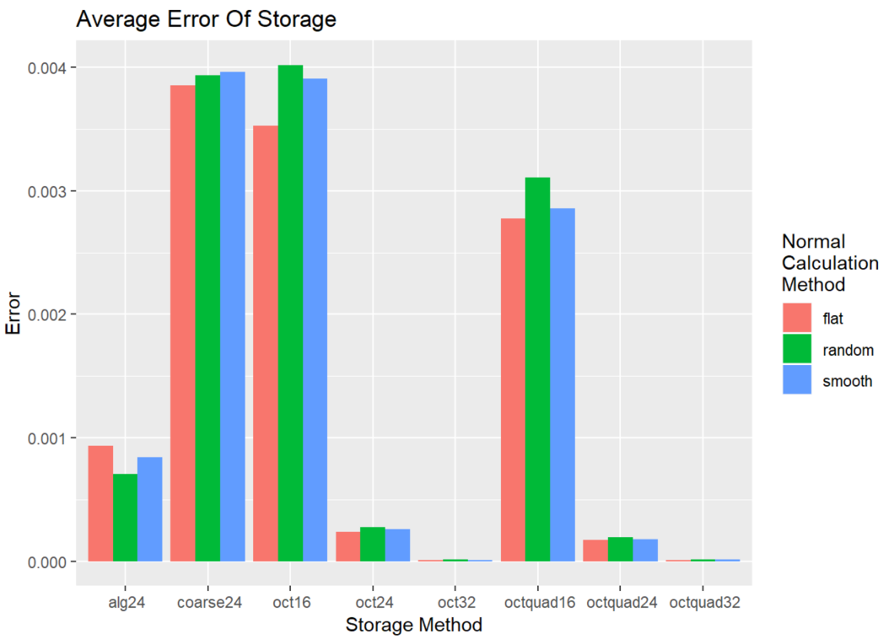
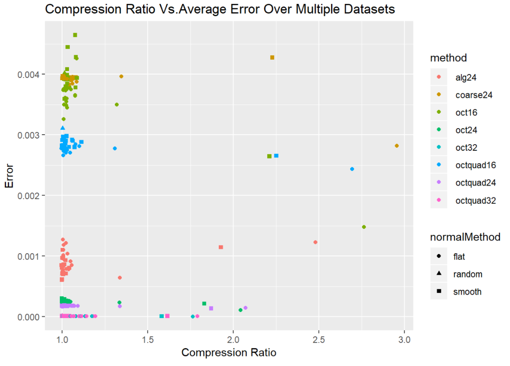

# Unit Packing
[](https://travis-ci.com/recolude/unitpacking) [](https://goreportcard.com/report/github.com/recolude/unitpacking) [](https://codecov.io/gh/recolude/unitpacking)

A library for storing unit vectors in a representnation that lends itself to saving space on disk. You can read more on how some of these methods work [here](https://elicdavis.medium.com/a-story-about-information-entropy-and-efficiently-storing-unit-vectors-92b4a68efe67).

## API

Currently there are 8 implemented methods for packing and unpacking unit vectors.

```
PackOct32/UnpackOct32
PackOct24/UnpackOct24
PackOct16/UnpackOct16
PackOctQuad16/UnpackOctQuad16
PackOctQuad24/UnpackOctQuad24
PackOctQuad32/UnpackOctQuad32
PackAlg24/UnpackAlg24
PackCoarse24/UnpackCoarse24
```

## Example

```golang
package main

import (
	"math/rand"
	"os"

	"github.com/EliCDavis/vector"
	"github.com/recolude/unitpacking/unitpacking"
)

func main() {
	numOfVectors := 10000000
	unitVectors := make([]vector.Vector3, numOfVectors)

	// Generate a bunch of unit vectors
	for i := 0; i < numOfVectors; i++ {
		unitVectors[i] = vector.NewVector3(
			(rand.Float64()*2.0)-1.0,
			(rand.Float64()*2.0)-1.0,
			(rand.Float64()*2.0)-1.0,
		).Normalized()
	}

	out, err := os.Create("example.data")
	if err != nil {
		panic(err)
	}

	// Write out unit vectors in packed format
	for _, unitVector := range unitVectors {
		out.Write(unitpacking.PackOct24(unitVector))
	}
}
```

## Benchmark

To benchmark the different methods, I took a bunch of common 3D models seen in computer graphics and generated both "smooth" and "flat" normals for them and used the normals as the unit vectors. Also one dataset is just 10 million randomly generated unit vectors. I hope the information present here will let you make an informed decision to pick the best method for your use case.

### Lowest Error

If what you are looking for is the lowest introduced error from converting between packed format and unpacked, you will want to go with `oct32` format. If you can handle a small bit of error in your calculations and speed is not a concern I would go with `octquad24`.




### File Size

Just by adopting one of these packing methods, you will see a cut of over half the space needed to store a unit vector as your datasets grow. The image below is a sums the compressed data from all datasets packed by each method. Baseline represents each unit vector being written out plainly as 3 32bit floats. If you want to reduce the filesize as much as possible, I would pick `octquad16`, as it has the highest amount of precision for all 16bit methods.


It appears that the `alg24` method lends itself to better compressability than `oct24` and `oct32` methods in some datasets. This might be a more attractive method if introducing some ammount of error to your program is not a problem. 



### Speed

If your goal is to compress data as fast as possible, I would go with the `alg24` method, as it has one of the faster runtimes while having way more precision than `coarse24`.


### Why Would I Ever Bother With Coarse?

Even though `coarse24` has the highest average error by far, there are still situations where this method might be what you need:

* You have to read this data in a language other than golang.
  * This method simply writes each float value to a single byte. While this is inefficient, it is simple to implement in other languages that need to read this data.
* You want to sample some random vector component quickly.
  * All other methods take advantage of math/algorithms to represent the data in an efficient format. To get the X,Y, and Z components back you have to re-apply this math/algorithms to get the original data back. 
  * If you wanted to get the average value along some axis under the coarse method however, you can easily just sample the byte array immediately.

### Hard Data

| Dataset | Method | Runtime | Average Error | Uncompressed | Compressed | Compression Ratio |
|-|-|-|-|-|-|-|
| 10 million random | Baseline | N/A | N/A | 117187 KB | 107717 KB | 1.0879 |
| 10 million random | alg24 | 398.3702ms | 0.000704 | 29296 KB | 29305 KB | <div style="color:red">0.9997</div> |
| 10 million random | coarse24 | 342.3312ms | 0.003937 | 29296 KB | 29234 KB | 1.0021 |
| 10 million random | oct16 | 1.5117462s | 0.004020 | 19531 KB | 19267 KB | 1.0137 |
| 10 million random | oct24 | 1.543465s | 0.000276 | 29296 KB | 29305 KB | <div style="color:red">0.9997</div> |
| 10 million random | oct32 | 1.5763905s | 0.000012 | 39062 KB | 39074 KB | <div style="color:red">0.9997</div> |
| 10 million random | octquad16 | 4.1228513s | 0.003110 | 19531 KB | 19480 KB | 1.0026 |
| 10 million random | octquad24 | 5.5927954s | 0.000194 | 29296 KB | 29305 KB | <div style="color:red">0.9997</div> |
| 10 million random | octquad32 | 6.5853774s | 0.000012 | 39062 KB | 39074 KB | <div style="color:red">0.9997</div> |
| armadillo flat | Baseline | N/A | N/A | 585 KB | 436 KB | 1.3415 |
| armadillo flat | alg24 | 1.9746ms | 0.000799 | 146 KB | 146 KB | 1.0013 |
| armadillo flat | coarse24 | 999.6µs | 0.003943 | 146 KB | 146 KB | 1.0030 |
| armadillo flat | oct16 | 7.9898ms | 0.003756 | 97 KB | 96 KB | 1.0105 |
| armadillo flat | oct24 | 7.1822ms | 0.000254 | 146 KB | 146 KB | 1.0015 |
| armadillo flat | oct32 | 7.0001ms | 0.000011 | 195 KB | 172 KB | 1.1347 |
| armadillo flat | octquad16 | 20.0286ms | 0.002923 | 97 KB | 97 KB | 1.0016 |
| armadillo flat | octquad24 | 24.9657ms | 0.000182 | 146 KB | 146 KB | 1.0029 |
| armadillo flat | octquad32 | 32.0289ms | 0.000011 | 195 KB | 172 KB | 1.1350 |
| armadillo smooth | Baseline | N/A | N/A | 585 KB | 540 KB | 1.0836 |
| armadillo smooth | alg24 | 3.0001ms | 0.000805 | 146 KB | 146 KB | <div style="color:red">0.9996</div> |
| armadillo smooth | coarse24 | 996.8µs | 0.003932 | 146 KB | 146 KB | 1.0003 |
| armadillo smooth | oct16 | 6.9461ms | 0.003944 | 97 KB | 96 KB | 1.0141 |
| armadillo smooth | oct24 | 7.0004ms | 0.000265 | 146 KB | 146 KB | <div style="color:red">0.9996</div> |
| armadillo smooth | oct32 | 8.009ms | 0.000011 | 195 KB | 195 KB | <div style="color:red">0.9997</div> |
| armadillo smooth | octquad16 | 19.9521ms | 0.002911 | 97 KB | 97 KB | 1.0018 |
| armadillo smooth | octquad24 | 26.032ms | 0.000182 | 146 KB | 146 KB | <div style="color:red">0.9996</div> |
| armadillo smooth | octquad32 | 37.0339ms | 0.000011 | 195 KB | 195 KB | <div style="color:red">0.9997</div> |
| beetle-alt flat | Baseline | N/A | N/A | 233 KB | 189 KB | 1.2318 |
| beetle-alt flat | alg24 | 984.5µs | 0.001217 | 58 KB | 56 KB | 1.0225 |
| beetle-alt flat | coarse24 | 0s | 0.003954 | 58 KB | 54 KB | 1.0611 |
| beetle-alt flat | oct16 | 3.0045ms | 0.003751 | 38 KB | 36 KB | 1.0509 |
| beetle-alt flat | oct24 | 3.0001ms | 0.000257 | 58 KB | 57 KB | 1.0102 |
| beetle-alt flat | oct32 | 3.0001ms | 0.000010 | 77 KB | 74 KB | 1.0432 |
| beetle-alt flat | octquad16 | 8.9721ms | 0.002703 | 38 KB | 37 KB | 1.0483 |
| beetle-alt flat | octquad24 | 14.4702ms | 0.000170 | 58 KB | 56 KB | 1.0353 |
| beetle-alt flat | octquad32 | 14.004ms | 0.000011 | 77 KB | 73 KB | 1.0536 |
| beetle-alt smooth | Baseline | N/A | N/A | 233 KB | 212 KB | 1.0965 |
| beetle-alt smooth | alg24 | 997.8µs | 0.000865 | 58 KB | 57 KB | 1.0138 |
| beetle-alt smooth | coarse24 | 1.0189ms | 0.003950 | 58 KB | 56 KB | 1.0402 |
| beetle-alt smooth | oct16 | 3.0235ms | 0.004281 | 38 KB | 35 KB | 1.0809 |
| beetle-alt smooth | oct24 | 3.0305ms | 0.000289 | 58 KB | 57 KB | 1.0141 |
| beetle-alt smooth | oct32 | 2.9986ms | 0.000011 | 77 KB | 76 KB | 1.0102 |
| beetle-alt smooth | octquad16 | 7.0219ms | 0.002917 | 38 KB | 36 KB | 1.0587 |
| beetle-alt smooth | octquad24 | 12.0015ms | 0.000183 | 58 KB | 56 KB | 1.0251 |
| beetle-alt smooth | octquad32 | 13.9682ms | 0.000011 | 77 KB | 76 KB | 1.0130 |
| beetle flat | Baseline | N/A | N/A | 13 KB | 11 KB | 1.1814 |
| beetle flat | alg24 | 0s | 0.001273 | 3 KB | 3 KB | 1.0053 |
| beetle flat | coarse24 | 0s | 0.003769 | 3 KB | 3 KB | 1.0214 |
| beetle flat | oct16 | 0s | 0.003735 | 2 KB | 2 KB | 1.0061 |
| beetle flat | oct24 | 0s | 0.000246 | 3 KB | 3 KB | <div style="color:red">0.9977</div> |
| beetle flat | oct32 | 0s | 0.000010 | 4 KB | 4 KB | 1.0227 |
| beetle flat | octquad16 | 0s | 0.002776 | 2 KB | 2 KB | <div style="color:red">0.9970</div> |
| beetle flat | octquad24 | 999.2µs | 0.000168 | 3 KB | 3 KB | <div style="color:red">0.9994</div> |
| beetle flat | octquad32 | 1.0094ms | 0.000011 | 4 KB | 4 KB | 1.0229 |
| beetle smooth | Baseline | N/A | N/A | 13 KB | 12 KB | 1.0984 |
| beetle smooth | alg24 | 0s | 0.000851 | 3 KB | 3 KB | <div style="color:red">0.9971</div> |
| beetle smooth | coarse24 | 0s | 0.003959 | 3 KB | 3 KB | 1.0106 |
| beetle smooth | oct16 | 0s | 0.004448 | 2 KB | 2 KB | 1.0333 |
| beetle smooth | oct24 | 0s | 0.000304 | 3 KB | 3 KB | <div style="color:red">0.9980</div> |
| beetle smooth | oct32 | 0s | 0.000012 | 4 KB | 4 KB | 1.0002 |
| beetle smooth | octquad16 | 0s | 0.002971 | 2 KB | 2 KB | 1.0048 |
| beetle smooth | octquad24 | 0s | 0.000190 | 3 KB | 3 KB | <div style="color:red">0.9991</div> |
| beetle smooth | octquad32 | 1ms | 0.000012 | 4 KB | 4 KB | <div style="color:red">0.9991</div> |
| cheburashka flat | Baseline | N/A | N/A | 78 KB | 43 KB | 1.7861 |
| cheburashka flat | alg24 | 0s | 0.000642 | 19 KB | 14 KB | 1.3377 |
| cheburashka flat | coarse24 | 0s | 0.003960 | 19 KB | 14 KB | 1.3455 |
| cheburashka flat | oct16 | 978.9µs | 0.003500 | 13 KB | 9 KB | 1.3199 |
| cheburashka flat | oct24 | 999.1µs | 0.000234 | 19 KB | 14 KB | 1.3358 |
| cheburashka flat | oct32 | 2.0027ms | 0.000011 | 26 KB | 16 KB | 1.5822 |
| cheburashka flat | octquad16 | 2.0003ms | 0.002776 | 13 KB | 9 KB | 1.3089 |
| cheburashka flat | octquad24 | 4.0007ms | 0.000174 | 19 KB | 14 KB | 1.3369 |
| cheburashka flat | octquad32 | 4.9972ms | 0.000011 | 26 KB | 16 KB | 1.5831 |
| cheburashka smooth | Baseline | N/A | N/A | 78 KB | 72 KB | 1.0831 |
| cheburashka smooth | alg24 | 0s | 0.000616 | 19 KB | 19 KB | <div style="color:red">0.9993</div> |
| cheburashka smooth | coarse24 | 0s | 0.003965 | 19 KB | 19 KB | 1.0033 |
| cheburashka smooth | oct16 | 1.0045ms | 0.003911 | 13 KB | 12 KB | 1.0200 |
| cheburashka smooth | oct24 | 1.0003ms | 0.000252 | 19 KB | 19 KB | <div style="color:red">0.9993</div> |
| cheburashka smooth | oct32 | 1.0001ms | 0.000011 | 26 KB | 26 KB | <div style="color:red">0.9994</div> |
| cheburashka smooth | octquad16 | 2.0263ms | 0.002830 | 13 KB | 12 KB | 1.0064 |
| cheburashka smooth | octquad24 | 5.0267ms | 0.000179 | 19 KB | 19 KB | 1.0001 |
| cheburashka smooth | octquad32 | 3.9715ms | 0.000011 | 26 KB | 26 KB | <div style="color:red">0.9994</div> |
| cow flat | Baseline | N/A | N/A | 34 KB | 23 KB | 1.4391 |
| cow flat | alg24 | 0s | 0.000735 | 8 KB | 8 KB | 1.0099 |
| cow flat | coarse24 | 986.1µs | 0.003966 | 8 KB | 8 KB | 1.0188 |
| cow flat | oct16 | 0s | 0.003499 | 5 KB | 5 KB | 1.0126 |
| cow flat | oct24 | 0s | 0.000230 | 8 KB | 8 KB | 1.0080 |
| cow flat | oct32 | 1.9669ms | 0.000011 | 11 KB | 10 KB | 1.1074 |
| cow flat | octquad16 | 1.9994ms | 0.002806 | 5 KB | 5 KB | 1.0069 |
| cow flat | octquad24 | 1.9997ms | 0.000172 | 8 KB | 8 KB | 1.0129 |
| cow flat | octquad32 | 2ms | 0.000011 | 11 KB | 10 KB | 1.1089 |
| cow smooth | Baseline | N/A | N/A | 34 KB | 31 KB | 1.0812 |
| cow smooth | alg24 | 0s | 0.000608 | 8 KB | 8 KB | <div style="color:red">0.9989</div> |
| cow smooth | coarse24 | 0s | 0.003939 | 8 KB | 8 KB | 1.0036 |
| cow smooth | oct16 | 998.7µs | 0.003917 | 5 KB | 5 KB | 1.0117 |
| cow smooth | oct24 | 994.7µs | 0.000255 | 8 KB | 8 KB | <div style="color:red">0.9989</div> |
| cow smooth | oct32 | 1.0001ms | 0.000011 | 11 KB | 11 KB | <div style="color:red">0.9991</div> |
| cow smooth | octquad16 | 2.001ms | 0.002816 | 5 KB | 5 KB | 1.0000 |
| cow smooth | octquad24 | 2.0055ms | 0.000177 | 8 KB | 8 KB | <div style="color:red">0.9989</div> |
| cow smooth | octquad32 | 1.9996ms | 0.000011 | 11 KB | 11 KB | <div style="color:red">0.9991</div> |
| fandisk flat | Baseline | N/A | N/A | 75 KB | 43 KB | 1.7632 |
| fandisk flat | alg24 | 0s | 0.001230 | 18 KB | 7 KB | 2.4786 |
| fandisk flat | coarse24 | 999.7µs | 0.002818 | 18 KB | 6 KB | 2.9539 |
| fandisk flat | oct16 | 983.3µs | 0.001480 | 12 KB | 4 KB | 2.7636 |
| fandisk flat | oct24 | 951.5µs | 0.000108 | 18 KB | 9 KB | 2.0428 |
| fandisk flat | oct32 | 1.0003ms | 0.000005 | 25 KB | 14 KB | 1.7644 |
| fandisk flat | octquad16 | 1.9998ms | 0.002437 | 12 KB | 4 KB | 2.6934 |
| fandisk flat | octquad24 | 2.9673ms | 0.000145 | 18 KB | 9 KB | 2.0705 |
| fandisk flat | octquad32 | 3.7969ms | 0.000009 | 25 KB | 14 KB | 1.7893 |
| fandisk smooth | Baseline | N/A | N/A | 75 KB | 48 KB | 1.5731 |
| fandisk smooth | alg24 | 0s | 0.001147 | 18 KB | 9 KB | 1.9277 |
| fandisk smooth | coarse24 | 0s | 0.004274 | 18 KB | 8 KB | 2.2281 |
| fandisk smooth | oct16 | 999.2µs | 0.002646 | 12 KB | 5 KB | 2.2110 |
| fandisk smooth | oct24 | 1.0305ms | 0.000215 | 18 KB | 10 KB | 1.8308 |
| fandisk smooth | oct32 | 1.0321ms | 0.000009 | 25 KB | 15 KB | 1.5819 |
| fandisk smooth | octquad16 | 3.0186ms | 0.002655 | 12 KB | 5 KB | 2.2510 |
| fandisk smooth | octquad24 | 2.9989ms | 0.000138 | 18 KB | 10 KB | 1.8703 |
| fandisk smooth | octquad32 | 2.993ms | 0.000011 | 25 KB | 15 KB | 1.6154 |
| happy flat | Baseline | N/A | N/A | 577 KB | 496 KB | 1.1628 |
| happy flat | alg24 | 1.9974ms | 0.000865 | 144 KB | 143 KB | 1.0029 |
| happy flat | coarse24 | 999.1µs | 0.003936 | 144 KB | 142 KB | 1.0102 |
| happy flat | oct16 | 7.9676ms | 0.003597 | 96 KB | 93 KB | 1.0264 |
| happy flat | oct24 | 7.004ms | 0.000241 | 144 KB | 143 KB | 1.0033 |
| happy flat | oct32 | 7.9984ms | 0.000011 | 192 KB | 183 KB | 1.0503 |
| happy flat | octquad16 | 20.9845ms | 0.002822 | 96 KB | 95 KB | 1.0120 |
| happy flat | octquad24 | 27.9652ms | 0.000176 | 144 KB | 143 KB | 1.0063 |
| happy flat | octquad32 | 32.996ms | 0.000011 | 192 KB | 183 KB | 1.0503 |
| happy smooth | Baseline | N/A | N/A | 577 KB | 531 KB | 1.0851 |
| happy smooth | alg24 | 1.9762ms | 0.000711 | 144 KB | 144 KB | 1.0015 |
| happy smooth | coarse24 | 2.2757ms | 0.003931 | 144 KB | 143 KB | 1.0081 |
| happy smooth | oct16 | 7.0308ms | 0.003912 | 96 KB | 92 KB | 1.0380 |
| happy smooth | oct24 | 6.986ms | 0.000255 | 144 KB | 143 KB | 1.0033 |
| happy smooth | oct32 | 7.0159ms | 0.000011 | 192 KB | 191 KB | 1.0025 |
| happy smooth | octquad16 | 22.0264ms | 0.002883 | 96 KB | 94 KB | 1.0169 |
| happy smooth | octquad24 | 29.0003ms | 0.000181 | 144 KB | 143 KB | 1.0051 |
| happy smooth | octquad32 | 34.0173ms | 0.000011 | 192 KB | 192 KB | 1.0015 |
| horse flat | Baseline | N/A | N/A | 568 KB | 523 KB | 1.0848 |
| horse flat | alg24 | 1.9998ms | 0.001013 | 142 KB | 140 KB | 1.0076 |
| horse flat | coarse24 | 999.8µs | 0.003928 | 142 KB | 138 KB | 1.0266 |
| horse flat | oct16 | 6.9994ms | 0.003549 | 94 KB | 92 KB | 1.0257 |
| horse flat | oct24 | 7.0053ms | 0.000237 | 142 KB | 141 KB | 1.0047 |
| horse flat | oct32 | 6.9769ms | 0.000011 | 189 KB | 188 KB | 1.0044 |
| horse flat | octquad16 | 18.9652ms | 0.002749 | 94 KB | 91 KB | 1.0305 |
| horse flat | octquad24 | 27.9848ms | 0.000172 | 142 KB | 140 KB | 1.0135 |
| horse flat | octquad32 | 33.1514ms | 0.000011 | 189 KB | 187 KB | 1.0076 |
| horse smooth | Baseline | N/A | N/A | 568 KB | 523 KB | 1.0863 |
| horse smooth | alg24 | 1.999ms | 0.000968 | 142 KB | 141 KB | 1.0069 |
| horse smooth | coarse24 | 999.7µs | 0.003948 | 142 KB | 138 KB | 1.0272 |
| horse smooth | oct16 | 5.998ms | 0.003780 | 94 KB | 90 KB | 1.0420 |
| horse smooth | oct24 | 5.9989ms | 0.000248 | 142 KB | 141 KB | 1.0062 |
| horse smooth | oct32 | 6.9996ms | 0.000011 | 189 KB | 188 KB | 1.0051 |
| horse smooth | octquad16 | 20.0356ms | 0.002801 | 94 KB | 91 KB | 1.0406 |
| horse smooth | octquad24 | 28.9667ms | 0.000175 | 142 KB | 139 KB | 1.0162 |
| horse smooth | octquad32 | 33.9999ms | 0.000011 | 189 KB | 187 KB | 1.0096 |
| igea flat | Baseline | N/A | N/A | 1574 KB | 1306 KB | 1.2051 |
| igea flat | alg24 | 5.9704ms | 0.000781 | 393 KB | 379 KB | 1.0384 |
| igea flat | coarse24 | 5.0045ms | 0.003924 | 393 KB | 368 KB | 1.0685 |
| igea flat | oct16 | 20.9955ms | 0.003640 | 262 KB | 243 KB | 1.0758 |
| igea flat | oct24 | 21.9314ms | 0.000247 | 393 KB | 381 KB | 1.0327 |
| igea flat | oct32 | 23.975ms | 0.000011 | 524 KB | 485 KB | 1.0816 |
| igea flat | octquad16 | 51.0072ms | 0.002846 | 262 KB | 243 KB | 1.0789 |
| igea flat | octquad24 | 68.0317ms | 0.000178 | 393 KB | 367 KB | 1.0724 |
| igea flat | octquad32 | 83.3463ms | 0.000011 | 524 KB | 477 KB | 1.0986 |
| igea smooth | Baseline | N/A | N/A | 1574 KB | 1445 KB | 1.0892 |
| igea smooth | alg24 | 5ms | 0.000931 | 393 KB | 385 KB | 1.0202 |
| igea smooth | coarse24 | 3.9998ms | 0.003938 | 393 KB | 374 KB | 1.0516 |
| igea smooth | oct16 | 18.003ms | 0.003782 | 262 KB | 243 KB | 1.0782 |
| igea smooth | oct24 | 18.997ms | 0.000249 | 393 KB | 387 KB | 1.0162 |
| igea smooth | oct32 | 17.9998ms | 0.000011 | 524 KB | 520 KB | 1.0086 |
| igea smooth | octquad16 | 47ms | 0.002797 | 262 KB | 244 KB | 1.0729 |
| igea smooth | octquad24 | 70.0391ms | 0.000175 | 393 KB | 382 KB | 1.0278 |
| igea smooth | octquad32 | 87.5491ms | 0.000011 | 524 KB | 515 KB | 1.0177 |
| lucy flat | Baseline | N/A | N/A | 585 KB | 425 KB | 1.3773 |
| lucy flat | alg24 | 2.9993ms | 0.001102 | 146 KB | 145 KB | 1.0067 |
| lucy flat | coarse24 | 1ms | 0.003923 | 146 KB | 144 KB | 1.0106 |
| lucy flat | oct16 | 6.9978ms | 0.003752 | 97 KB | 95 KB | 1.0269 |
| lucy flat | oct24 | 7.9994ms | 0.000258 | 146 KB | 145 KB | 1.0072 |
| lucy flat | oct32 | 6.9964ms | 0.000011 | 195 KB | 165 KB | 1.1777 |
| lucy flat | octquad16 | 19.9692ms | 0.002860 | 97 KB | 95 KB | 1.0207 |
| lucy flat | octquad24 | 29.0452ms | 0.000179 | 146 KB | 143 KB | 1.0187 |
| lucy flat | octquad32 | 32.0333ms | 0.000011 | 195 KB | 165 KB | 1.1803 |
| lucy smooth | Baseline | N/A | N/A | 585 KB | 539 KB | 1.0868 |
| lucy smooth | alg24 | 2.0083ms | 0.001102 | 146 KB | 145 KB | 1.0033 |
| lucy smooth | coarse24 | 1.0003ms | 0.003938 | 146 KB | 145 KB | 1.0075 |
| lucy smooth | oct16 | 6.9975ms | 0.003945 | 97 KB | 94 KB | 1.0325 |
| lucy smooth | oct24 | 5.9735ms | 0.000264 | 146 KB | 145 KB | 1.0036 |
| lucy smooth | oct32 | 7.0005ms | 0.000011 | 195 KB | 194 KB | 1.0025 |
| lucy smooth | octquad16 | 21.5069ms | 0.002904 | 97 KB | 95 KB | 1.0232 |
| lucy smooth | octquad24 | 30.27ms | 0.000181 | 146 KB | 144 KB | 1.0104 |
| lucy smooth | octquad32 | 34.037ms | 0.000011 | 195 KB | 194 KB | 1.0053 |
| max-planck flat | Baseline | N/A | N/A | 586 KB | 519 KB | 1.1289 |
| max-planck flat | alg24 | 2.0012ms | 0.000718 | 146 KB | 145 KB | 1.0075 |
| max-planck flat | coarse24 | 1.966ms | 0.003942 | 146 KB | 145 KB | 1.0095 |
| max-planck flat | oct16 | 7.0286ms | 0.003609 | 97 KB | 96 KB | 1.0185 |
| max-planck flat | oct24 | 5.9986ms | 0.000247 | 146 KB | 145 KB | 1.0055 |
| max-planck flat | oct32 | 6.9976ms | 0.000011 | 195 KB | 190 KB | 1.0277 |
| max-planck flat | octquad16 | 19.9998ms | 0.002872 | 97 KB | 95 KB | 1.0196 |
| max-planck flat | octquad24 | 27.9984ms | 0.000180 | 146 KB | 144 KB | 1.0178 |
| max-planck flat | octquad32 | 30.9965ms | 0.000011 | 195 KB | 189 KB | 1.0325 |
| max-planck smooth | Baseline | N/A | N/A | 586 KB | 540 KB | 1.0866 |
| max-planck smooth | alg24 | 2.9894ms | 0.000703 | 146 KB | 145 KB | 1.0062 |
| max-planck smooth | coarse24 | 1.0109ms | 0.003940 | 146 KB | 145 KB | 1.0086 |
| max-planck smooth | oct16 | 7.0068ms | 0.003798 | 97 KB | 95 KB | 1.0210 |
| max-planck smooth | oct24 | 9.7555ms | 0.000256 | 146 KB | 146 KB | 1.0040 |
| max-planck smooth | oct32 | 6.9987ms | 0.000011 | 195 KB | 195 KB | 1.0026 |
| max-planck smooth | octquad16 | 21.632ms | 0.002864 | 97 KB | 95 KB | 1.0192 |
| max-planck smooth | octquad24 | 28.0268ms | 0.000179 | 146 KB | 145 KB | 1.0095 |
| max-planck smooth | octquad32 | 35.9722ms | 0.000011 | 195 KB | 194 KB | 1.0053 |
| nefertiti flat | Baseline | N/A | N/A | 585 KB | 424 KB | 1.3788 |
| nefertiti flat | alg24 | 999.9µs | 0.000848 | 146 KB | 138 KB | 1.0563 |
| nefertiti flat | coarse24 | 2.001ms | 0.003932 | 146 KB | 135 KB | 1.0818 |
| nefertiti flat | oct16 | 5.9874ms | 0.003657 | 97 KB | 90 KB | 1.0765 |
| nefertiti flat | oct24 | 6.999ms | 0.000245 | 146 KB | 139 KB | 1.0491 |
| nefertiti flat | oct32 | 7.0007ms | 0.000011 | 195 KB | 166 KB | 1.1747 |
| nefertiti flat | octquad16 | 21.3695ms | 0.002814 | 97 KB | 88 KB | 1.1015 |
| nefertiti flat | octquad24 | 25.9725ms | 0.000176 | 146 KB | 134 KB | 1.0924 |
| nefertiti flat | octquad32 | 29.9629ms | 0.000011 | 195 KB | 163 KB | 1.1950 |
| nefertiti smooth | Baseline | N/A | N/A | 585 KB | 534 KB | 1.0964 |
| nefertiti smooth | alg24 | 2.0007ms | 0.000806 | 146 KB | 140 KB | 1.0417 |
| nefertiti smooth | coarse24 | 1.9596ms | 0.003948 | 146 KB | 135 KB | 1.0793 |
| nefertiti smooth | oct16 | 7.0233ms | 0.003936 | 97 KB | 89 KB | 1.0861 |
| nefertiti smooth | oct24 | 9.0006ms | 0.000260 | 146 KB | 141 KB | 1.0364 |
| nefertiti smooth | oct32 | 6.9925ms | 0.000011 | 195 KB | 191 KB | 1.0214 |
| nefertiti smooth | octquad16 | 19.9863ms | 0.002881 | 97 KB | 87 KB | 1.1134 |
| nefertiti smooth | octquad24 | 27.0145ms | 0.000180 | 146 KB | 137 KB | 1.0612 |
| nefertiti smooth | octquad32 | 34.9973ms | 0.000011 | 195 KB | 187 KB | 1.0406 |
| ogre flat | Baseline | N/A | N/A | 728 KB | 521 KB | 1.3967 |
| ogre flat | alg24 | 1.9898ms | 0.000786 | 182 KB | 177 KB | 1.0248 |
| ogre flat | coarse24 | 2.0344ms | 0.003829 | 182 KB | 175 KB | 1.0397 |
| ogre flat | oct16 | 9.0339ms | 0.003447 | 121 KB | 118 KB | 1.0293 |
| ogre flat | oct24 | 9.0201ms | 0.000230 | 182 KB | 178 KB | 1.0230 |
| ogre flat | oct32 | 10.0341ms | 0.000010 | 242 KB | 214 KB | 1.1348 |
| ogre flat | octquad16 | 24.3084ms | 0.002704 | 121 KB | 118 KB | 1.0225 |
| ogre flat | octquad24 | 35.9854ms | 0.000171 | 182 KB | 175 KB | 1.0363 |
| ogre flat | octquad32 | 41.9872ms | 0.000011 | 242 KB | 212 KB | 1.1418 |
| ogre smooth | Baseline | N/A | N/A | 728 KB | 663 KB | 1.0981 |
| ogre smooth | alg24 | 2.9991ms | 0.000838 | 182 KB | 180 KB | 1.0078 |
| ogre smooth | coarse24 | 2.0001ms | 0.003944 | 182 KB | 178 KB | 1.0183 |
| ogre smooth | oct16 | 9.9979ms | 0.003844 | 121 KB | 118 KB | 1.0293 |
| ogre smooth | oct24 | 9.0022ms | 0.000251 | 182 KB | 181 KB | 1.0066 |
| ogre smooth | oct32 | 7.9807ms | 0.000011 | 242 KB | 240 KB | 1.0094 |
| ogre smooth | octquad16 | 27.9908ms | 0.002808 | 121 KB | 119 KB | 1.0149 |
| ogre smooth | octquad24 | 39.0314ms | 0.000176 | 182 KB | 180 KB | 1.0098 |
| ogre smooth | octquad32 | 44.0336ms | 0.000011 | 242 KB | 240 KB | 1.0102 |
| rocker-arm flat | Baseline | N/A | N/A | 117 KB | 92 KB | 1.2751 |
| rocker-arm flat | alg24 | 0s | 0.001186 | 29 KB | 29 KB | 1.0086 |
| rocker-arm flat | coarse24 | 0s | 0.003932 | 29 KB | 28 KB | 1.0248 |
| rocker-arm flat | oct16 | 2.0004ms | 0.003257 | 19 KB | 19 KB | 1.0091 |
| rocker-arm flat | oct24 | 2.0375ms | 0.000222 | 29 KB | 29 KB | <div style="color:red">0.9998</div> |
| rocker-arm flat | oct32 | 1.0022ms | 0.000010 | 39 KB | 35 KB | 1.1120 |
| rocker-arm flat | octquad16 | 5.0551ms | 0.002663 | 19 KB | 19 KB | 1.0078 |
| rocker-arm flat | octquad24 | 7.0301ms | 0.000166 | 29 KB | 29 KB | 1.0045 |
| rocker-arm flat | octquad32 | 6.9669ms | 0.000010 | 39 KB | 35 KB | 1.1134 |
| rocker-arm smooth | Baseline | N/A | N/A | 117 KB | 108 KB | 1.0832 |
| rocker-arm smooth | alg24 | 0s | 0.000970 | 29 KB | 29 KB | 1.0037 |
| rocker-arm smooth | coarse24 | 0s | 0.003938 | 29 KB | 29 KB | 1.0125 |
| rocker-arm smooth | oct16 | 2.0005ms | 0.003593 | 19 KB | 19 KB | 1.0151 |
| rocker-arm smooth | oct24 | 999.1µs | 0.000238 | 29 KB | 29 KB | 1.0000 |
| rocker-arm smooth | oct32 | 2.0319ms | 0.000011 | 39 KB | 39 KB | <div style="color:red">0.9995</div> |
| rocker-arm smooth | octquad16 | 4.0264ms | 0.002782 | 19 KB | 19 KB | 1.0092 |
| rocker-arm smooth | octquad24 | 6.0005ms | 0.000173 | 29 KB | 29 KB | 1.0028 |
| rocker-arm smooth | octquad32 | 6.9746ms | 0.000011 | 39 KB | 39 KB | 1.0004 |
| spot flat | Baseline | N/A | N/A | 34 KB | 20 KB | 1.6768 |
| spot flat | alg24 | 0s | 0.000941 | 8 KB | 8 KB | 1.0150 |
| spot flat | coarse24 | 0s | 0.003928 | 8 KB | 8 KB | 1.0301 |
| spot flat | oct16 | 0s | 0.003731 | 5 KB | 5 KB | 1.0202 |
| spot flat | oct24 | 0s | 0.000240 | 8 KB | 8 KB | 1.0123 |
| spot flat | oct32 | 2.0022ms | 0.000011 | 11 KB | 10 KB | 1.1365 |
| spot flat | octquad16 | 1.0001ms | 0.002733 | 5 KB | 5 KB | 1.0103 |
| spot flat | octquad24 | 999.7µs | 0.000169 | 8 KB | 8 KB | 1.0245 |
| spot flat | octquad32 | 2.0304ms | 0.000011 | 11 KB | 10 KB | 1.1376 |
| spot smooth | Baseline | N/A | N/A | 34 KB | 31 KB | 1.0866 |
| spot smooth | alg24 | 0s | 0.000808 | 8 KB | 8 KB | <div style="color:red">0.9989</div> |
| spot smooth | coarse24 | 0s | 0.003954 | 8 KB | 8 KB | 1.0047 |
| spot smooth | oct16 | 999.5µs | 0.003943 | 5 KB | 5 KB | 1.0123 |
| spot smooth | oct24 | 0s | 0.000257 | 8 KB | 8 KB | <div style="color:red">0.9989</div> |
| spot smooth | oct32 | 0s | 0.000011 | 11 KB | 11 KB | <div style="color:red">0.9991</div> |
| spot smooth | octquad16 | 2.0263ms | 0.002826 | 5 KB | 5 KB | <div style="color:red">0.9993</div> |
| spot smooth | octquad24 | 1.9999ms | 0.000178 | 8 KB | 8 KB | <div style="color:red">0.9989</div> |
| spot smooth | octquad32 | 999.4µs | 0.000011 | 11 KB | 11 KB | <div style="color:red">0.9991</div> |
| stanford-bunny flat | Baseline | N/A | N/A | 421 KB | 317 KB | 1.3285 |
| stanford-bunny flat | alg24 | 998.6µs | 0.000913 | 105 KB | 100 KB | 1.0492 |
| stanford-bunny flat | coarse24 | 1.0001ms | 0.003875 | 105 KB | 97 KB | 1.0855 |
| stanford-bunny flat | oct16 | 5.0051ms | 0.004258 | 70 KB | 64 KB | 1.0842 |
| stanford-bunny flat | oct24 | 5.0053ms | 0.000244 | 105 KB | 101 KB | 1.0413 |
| stanford-bunny flat | oct32 | 4.9996ms | 0.000011 | 140 KB | 123 KB | 1.1342 |
| stanford-bunny flat | octquad16 | 14ms | 0.002818 | 70 KB | 65 KB | 1.0731 |
| stanford-bunny flat | octquad24 | 20ms | 0.000176 | 105 KB | 98 KB | 1.0726 |
| stanford-bunny flat | octquad32 | 30.998ms | 0.000011 | 140 KB | 122 KB | 1.1426 |
| stanford-bunny smooth | Baseline | N/A | N/A | 421 KB | 376 KB | 1.1186 |
| stanford-bunny smooth | alg24 | 2.0276ms | 0.000712 | 105 KB | 102 KB | 1.0228 |
| stanford-bunny smooth | coarse24 | 972.4µs | 0.003903 | 105 KB | 99 KB | 1.0543 |
| stanford-bunny smooth | oct16 | 4.9999ms | 0.004644 | 70 KB | 65 KB | 1.0759 |
| stanford-bunny smooth | oct24 | 6.0005ms | 0.000265 | 105 KB | 102 KB | 1.0242 |
| stanford-bunny smooth | oct32 | 4.9996ms | 0.000012 | 140 KB | 137 KB | 1.0245 |
| stanford-bunny smooth | octquad16 | 15.9985ms | 0.002900 | 70 KB | 66 KB | 1.0625 |
| stanford-bunny smooth | octquad24 | 21.9964ms | 0.000183 | 105 KB | 101 KB | 1.0375 |
| stanford-bunny smooth | octquad32 | 24.03ms | 0.000011 | 140 KB | 136 KB | 1.0293 |
| teapot flat | Baseline | N/A | N/A | 42 KB | 30 KB | 1.4060 |
| teapot flat | alg24 | 0s | 0.001040 | 10 KB | 10 KB | 1.0319 |
| teapot flat | coarse24 | 0s | 0.003842 | 10 KB | 10 KB | 1.0600 |
| teapot flat | oct16 | 0s | 0.003486 | 7 KB | 6 KB | 1.0240 |
| teapot flat | oct24 | 0s | 0.000246 | 10 KB | 10 KB | 1.0145 |
| teapot flat | oct32 | 0s | 0.000011 | 14 KB | 13 KB | 1.0664 |
| teapot flat | octquad16 | 2.0002ms | 0.002783 | 7 KB | 6 KB | 1.0209 |
| teapot flat | octquad24 | 2.0471ms | 0.000169 | 10 KB | 10 KB | 1.0205 |
| teapot flat | octquad32 | 1.9984ms | 0.000011 | 14 KB | 13 KB | 1.0707 |
| teapot smooth | Baseline | N/A | N/A | 42 KB | 39 KB | 1.0864 |
| teapot smooth | alg24 | 0s | 0.000972 | 10 KB | 10 KB | 1.0016 |
| teapot smooth | coarse24 | 998.9µs | 0.003953 | 10 KB | 10 KB | 1.0189 |
| teapot smooth | oct16 | 0s | 0.003984 | 7 KB | 6 KB | 1.0297 |
| teapot smooth | oct24 | 0s | 0.000257 | 10 KB | 10 KB | 1.0003 |
| teapot smooth | oct32 | 999.6µs | 0.000011 | 14 KB | 14 KB | 1.0003 |
| teapot smooth | octquad16 | 1.9707ms | 0.002902 | 7 KB | 7 KB | 1.0162 |
| teapot smooth | octquad24 | 1.9999ms | 0.000181 | 10 KB | 10 KB | 1.0011 |
| teapot smooth | octquad32 | 3.0001ms | 0.000011 | 14 KB | 14 KB | <div style="color:red">0.9994</div> |
| xyzrgb_dragon flat | Baseline | N/A | N/A | 1465 KB | 1250 KB | 1.1722 |
| xyzrgb_dragon flat | alg24 | 4.9662ms | 0.000775 | 366 KB | 364 KB | 1.0049 |
| xyzrgb_dragon flat | coarse24 | 4.9695ms | 0.003935 | 366 KB | 363 KB | 1.0090 |
| xyzrgb_dragon flat | oct16 | 18.0339ms | 0.003774 | 244 KB | 239 KB | 1.0185 |
| xyzrgb_dragon flat | oct24 | 18.9996ms | 0.000255 | 366 KB | 364 KB | 1.0050 |
| xyzrgb_dragon flat | oct32 | 17.9738ms | 0.000011 | 488 KB | 465 KB | 1.0504 |
| xyzrgb_dragon flat | octquad16 | 49.9681ms | 0.002920 | 244 KB | 240 KB | 1.0171 |
| xyzrgb_dragon flat | octquad24 | 74.8258ms | 0.000182 | 366 KB | 361 KB | 1.0137 |
| xyzrgb_dragon flat | octquad32 | 80.9937ms | 0.000011 | 488 KB | 463 KB | 1.0533 |
| xyzrgb_dragon smooth | Baseline | N/A | N/A | 1465 KB | 1343 KB | 1.0906 |
| xyzrgb_dragon smooth | alg24 | 4.9987ms | 0.000733 | 366 KB | 364 KB | 1.0042 |
| xyzrgb_dragon smooth | coarse24 | 5.0232ms | 0.003942 | 366 KB | 362 KB | 1.0102 |
| xyzrgb_dragon smooth | oct16 | 20.9674ms | 0.004083 | 244 KB | 237 KB | 1.0301 |
| xyzrgb_dragon smooth | oct24 | 18.032ms | 0.000273 | 366 KB | 364 KB | 1.0056 |
| xyzrgb_dragon smooth | oct32 | 18.9857ms | 0.000011 | 488 KB | 486 KB | 1.0046 |
| xyzrgb_dragon smooth | octquad16 | 50.999ms | 0.002980 | 244 KB | 238 KB | 1.0263 |
| xyzrgb_dragon smooth | octquad24 | 73.0343ms | 0.000187 | 366 KB | 361 KB | 1.0128 |
| xyzrgb_dragon smooth | octquad32 | 88.036ms | 0.000012 | 488 KB | 484 KB | 1.0079 |

## Resources

* [A Survey of Efficient Representations for Independent Unit Vectors](http://jcgt.org/published/0003/02/01/paper.pdf)
* [Alec Jacobson's Common 3D Test Models](https://github.com/alecjacobson/common-3d-test-models)